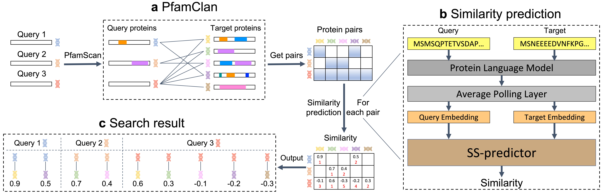

# SS-filter

This is the implement of "SS-filter: exploring protein language model for protein sequence search". By using a protein language model, SS-filter can achieve `a sensitivity close to SOAT structure search methods` while being versatile and fast because it is `only based on sequences`.

<div align=center></div>

## Quick links

* [Webserver](#webserver)
* [Requirements](#requirements)
  * [Universial](#universial)
  * [Optional](#optional)
* [Data preparation](#data-preparation)
  * [Data](#ss-filter-data)
  * [Protein language model](#protein-language-model)
* [Reproduce all our experiments with only one file](#main)
* [Use SS-filter to search your own data](#pipeline)
* [Citation](#citation)

## Webserver
<span id="webserver"></span>
Search your own protein sequences against `themselves` and [Swiss-Prot](https://www.uniprot.org/) in seconds using our SS-filter webserver: [issubmission.sjtu.edu.cn/ss-filter/](https://issubmission.sjtu.edu.cn/ss-filter/) 🚀

## Requirements
<span id="requirements"></span>

### Universial
<span id="universial"></span>

python 3.8 / biopython 1.78 / tqdm 4.64.1 / torch 1.7.1 / pandas 1.5.1 / 
seaborn 0.12.1 / matplotlib-venn 0.11.7 / logzero 1.7.0 / scikit-learn 0.24.2 /

### Optional
<span id="optional"></span>

ipykernel 6.15.2 / cython 0.29.32 / pyspark 3.3.1 / pfamscan 1.6

If you are a beginner, you can choose to follow the steps in `requirements.sh`.

## Data preparation
<span id="data-preparation"></span>
We provide acquirement approach of `Data` and `Protein language model`.

### Data
<span id="ss-filter-data"></span>
We have released our prepared data **ss_filter_data** in [Webserver source](https://issubmission.sjtu.edu.cn/ss-filter/static/download/ss_filter_data.tar.gz).
```bash
# Put it in home directory and tar
tar zxvf ss_filter_data.tar.gz
```

### Protein language model
<span id="protein-language-model"></span>
```bash
# Download ESM-1b
cd ./ss_filter/esm/saved_models
wget https://dl.fbaipublicfiles.com/fair-esm/models/esm1b_t33_650M_UR50S.pt
wget https://dl.fbaipublicfiles.com/fair-esm/regression/esm1b_t33_650M_UR50S-contact-regression.pt
# Go back to the raw directory 
cd ../../..
```

## Reproduce all our experiments with only one line
<span id="main"></span>
```bash
python ss_filter/main.py
```

You can also follow the steps in `main.ipynb` to get the same result with better visualization.

**Notice: the results are saved in** `scientist_figures/`.

## Search your own data
<span id="pipeline"></span>
Search your own protein sequences against `themselves` and [Swiss-Prot](https://www.uniprot.org/). 

- For `GPU` users, follow the example in `pipeline.ipynb`.

- For `CPU ONLY` users, follow the example in `pipeline_cpu.ipynb`.

**Notice: the inputs and outputs of the example are all saved in** `example/`.

## Citation
<span id="citation"></span>
```
@inproceedings{
}
```