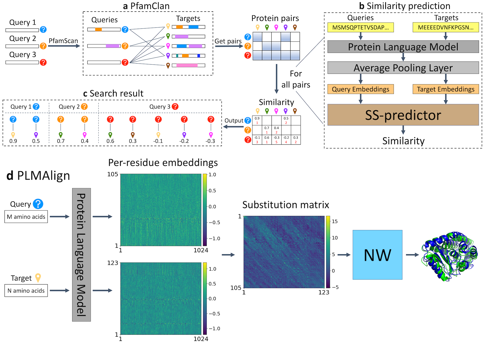

# PLMSearch

This is the implement of "PLMSearch: Protein language model powers accurate and fast sequence search for remote homology". By using a protein language model, PLMSearch can achieve `a sensitivity close to SOAT structure search methods` while being versatile and fast because it is `only based on sequences`.

<div align=center></div>

## Quick links

* [Webserver](#webserver)
* [Requirements](#requirements)
* [Data preparation](#data-preparation)
  * [Data](#PLMSearch-data)
  * [Protein language model](#protein-language-model)
* [Reproduce all our experiments with only one file](#main)
* [Build PLMSearch locally](#pipeline)
* [Citation](#citation)

## Webserver
<span id="webserver"></span>
PLMSearch web server : [dmiip.sjtu.edu.cn/PLMSearch](https://dmiip.sjtu.edu.cn/PLMSearch/) 🚀

PLMAlign  web server : [dmiip.sjtu.edu.cn/PLMAlign](https://dmiip.sjtu.edu.cn/PLMAlign/) :airplane:

PLMAlign source code : [github.com/maovshao/PLMAlign](https://github.com/maovshao/PLMAlign/) :helicopter:

## Requirements
<span id="requirements"></span>

Follow the steps in [requirements.sh](requirements.sh)

## Data preparation
<span id="data-preparation"></span>
We provide acquirement approach of `Data`.

### Data
<span id="PLMSearch-data"></span>
We have released our experiment data in [plmsearch_data](https://dmiip.sjtu.edu.cn/PLMSearch/static/download/plmsearch_data.tar.gz).
```bash
# Include experiment data, PLMSearch model, ESM-1b model, etc.
wget https://dmiip.sjtu.edu.cn/PLMSearch/static/download/plmsearch_data.tar.gz
tar zxvf plmsearch_data.tar.gz
```

## Reproduce all our experiments with only one file
<span id="main"></span>

- Reproduce all our experiments with good visualization by following the steps in [main.ipynb](main.ipynb)

**Notice: Detailed results are saved in** `scientist_figures/`.

## Run PLMSearch locally
<span id="pipeline"></span>

- Run PLMSearch locally by following the example in [pipeline.ipynb](pipeline.ipynb)

**Notice: the inputs and outputs of the example are saved in** `example/`.

## Citation
<span id="citation"></span>
If you find the tool useful in your research, we ask that you cite the relevant paper:
```bibtex
@article {Liu2023.04.03.535375,
  author = {Liu, Wei and Wang, Ziye and You, Ronghui and Xie, Chenghan and Wei, Hong and Xiong, Yi and Yang, Jianyi and Zhu, Shanfeng},
  title = {Protein language model powers accurate and fast sequence search for remote homology},
  year = {2023},
  doi = {10.1101/2023.04.03.535375},
  URL = {https://www.biorxiv.org/content/early/2023/04/05/2023.04.03.535375},
  journal = {bioRxiv}
}
```
